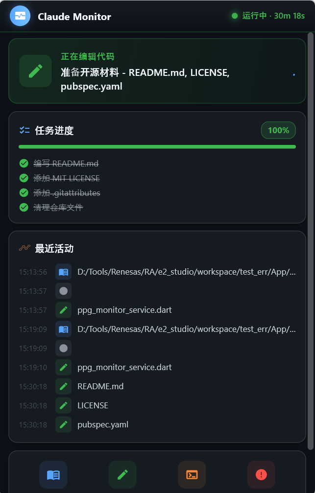

# 🫧 Context Gauge

A minimal ambient indicator that shows Claude Code's context window usage — like a fuel gauge for your conversation.

<p align="center">
  
</p>

## Design

A tiny 80×80 translucent ring that lives in the bottom-right corner of your screen. The ring empties clockwise as your context fills up. No interaction, no distraction — just glance and know.

| Remaining | Color | Feel |
|-----------|-------|------|
| 60–100% | `#58A6FF` Blue | Plenty of headroom |
| 30–60% | `#F0883E` Orange | Getting full — pay attention |
| 0–30% | `#F85149` Red | Almost out — compact soon |
| Compacting | `#9944FF` Purple | Compacting in progress |

The ring renders with 3-layer glow (outer halo → mid transition → core line), morphing smoothly between states. The center shows remaining percentage.

## Architecture

```
Claude Code → statusLine hook (PS) → %TEMP%/claude-context-gauge.json
                                    ↓
                              Tauri app (150ms poll)
                                    ↓
                              Canvas 2D renderer
```

- **statusLine hook**: Reads session JSON from Claude Code, extracts `context_window.remaining_percentage`, writes to temp file
- **Event hooks**: Handle lifecycle (compacting / stopped)
- **Tauri + Canvas**: Transparent always-on-top window with animated ring gauge

## Build

```bash
# Install Rust
curl --proto '=https' --tlsv1.2 -sSf https://sh.rustup.rs | sh

# Install Tauri CLI
cargo install tauri-cli

# Build
cd src-tauri
cargo build --release
# Output: src-tauri/target/release/context-gauge.exe
```

## Hook Setup

The hooks are registered in `~/.claude/settings.json`:

| Event | Action |
|-------|--------|
| `statusLine` | Writes context % to gauge file |
| `SessionStart` | Launches gauge exe + sets idle |
| `PreCompact` | Sets compacting state |
| `Stop` | Sets stopped state |

## Tech Stack

- **Tauri 2** — lightweight cross-platform desktop shell
- **Canvas 2D** — 3-layer ring rendering with morphing
- **PowerShell** — Claude Code hook scripts
- **Rust** — state machine + file polling

## Coexistence with Claude Halo

Context Gauge sits above Halo on screen (positioned at `screen_height - 80 - 240` vs Halo's `screen_height - 100 - 140`). Both share the same hook events without conflict.

## License

MIT
